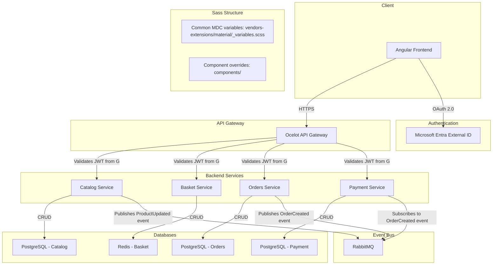

# System Patterns: Personal E-Commerce Application

This document describes the system architecture, key technical decisions, and design patterns for the e-commerce application.

## 0. Styling & SASS Structure

- The project uses the SASS 7-1 architecture for scalable and maintainable styles.
- Each style folder contains an `_index.scss` to forward all partials, and `main.scss` imports only the index files.
- Import order: abstracts → base → layout → components → vendors → themes.
- Vendor and component overrides for Angular Material are placed in `vendors-extensions/` and `components/` respectively.

## 1. System Architecture

The application follows a microservices architecture. The system is composed of several independent services that communicate with each other through an API Gateway and an event bus.

## 2. Key Technical Decisions

- **Polyrepo:** Each microservice will reside in its own repository. This promotes service independence and allows for separate build and deployment pipelines.
- **Microservices:** The backend is split into distinct services based on business capabilities (Catalog, Basket, Orders, Payment). This enhances modularity, scalability, and maintainability.
- **API Gateway (Ocelot):** A single entry point for the frontend to interact with the backend services. It handles request routing, aggregation, and cross-cutting concerns like authentication and logging.
- **Event-Driven Communication (RabbitMQ):** Services will communicate asynchronously using an event bus. This decouples services and improves resilience. For example, when an order is created, the Orders service will publish an `OrderCreated` event, which other services (like Payment) can subscribe to.
- **Externalized Authentication (Microsoft Entra External ID):** Authentication is delegated to a managed service. This simplifies the architecture by removing the need for a dedicated Identity microservice and leverages a robust, scalable, and secure identity solution. All microservices will be responsible for validating the JWTs issued by Entra External ID.
- **Containerization (Docker):** All backend services will be containerized, ensuring consistency across all environments and simplifying deployment.

## 3. Design Patterns

- **Domain-Driven Design (DDD):** Each microservice will be designed around a specific business domain, with its own bounded context, entities, and aggregates.
- **Separation of Concerns:** The architecture separates the frontend, backend, database, and authentication into distinct layers and services.
- **CQRS (Command Query Responsibility Segregation):** While not a primary goal for the initial implementation, the architecture is well-suited for adopting CQRS in the future if performance requirements for read and write operations diverge.
- **Repository Pattern:** Data access in each service will be abstracted through a repository layer, decoupling the business logic from the data persistence technology.
